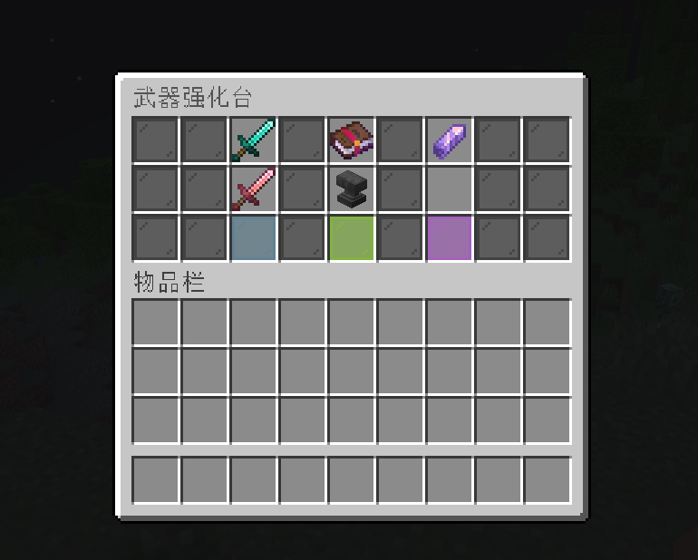
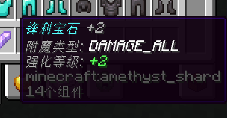

# EnchantGems

`EnchantGems` 是一个基于 Paper 的 Minecraft 插件，用宝石道具为武器、工具和护甲附加或提升附魔等级。

## 界面预览

### 强化台界面



### 宝石展示



## 功能概览

- 通过 `/gem forge` 或 `/gem upgrade` 打开强化台 GUI
- 通过命令生成附魔宝石并发放给玩家
- 宝石信息写入 `PersistentDataContainer`，不会和普通紫水晶碎片混淆
- 强化时自动校验附魔适用装备、附魔冲突和最高等级
- 菜单关闭或玩家掉线时自动返还未使用的物品
- 支持通过 `config.yml`、`gems.yml`、`menu.yml` 自定义语言、宝石定义和菜单布局

## 运行环境

- Paper `1.21.x`
- Java `21`

## 指令

`/gem forge`
打开宝石强化台。

`/gem upgrade`
与 `/gem forge` 相同，用于打开强化台。

`/gem give <玩家> <附魔ID> <等级>`
为指定玩家发放一个附魔宝石。

`/gem reload`
重载插件配置文件。

插件别名：`/gemenhancer`

## 权限

- `gemenhancer.use`：使用强化台，默认 `true`
- `gemenhancer.give`：使用发放宝石命令，默认 `op`
- `gemenhancer.reload`：重载配置，默认 `op`

## 配置文件

[`config.yml`](src/main/resources/config.yml)
基础配置，包含版本号、语言和成功/失败音效。

[`gems.yml`](src/main/resources/gems.yml)
定义宝石外观、附魔显示名、最大等级和是否启用。

[`menu.yml`](src/main/resources/menu.yml)
定义强化台标题、布局和图标显示。

## 支持的附魔输入

`/gem give` 支持两种输入方式：

- 旧版常量名，例如 `DAMAGE_ALL`
- 命名空间 ID，例如 `minecraft:sharpness` 或 `sharpness`

默认已预设常见护甲、武器、工具、弓弩、三叉戟、狼牙棒与钓鱼竿附魔，具体列表见 [`gems.yml`](src/main/resources/gems.yml)。

## 构建

```bash
mvn clean package
```

构建完成后，成品 jar 默认位于：

```text
target/EnchantGems-1.0-shaded.jar
```

## 安装

1. 将构建后的 jar 放入服务器的 `plugins/` 目录。
2. 启动服务器生成配置文件。
3. 按需修改配置后执行 `/gem reload` 或重启服务器。

## 当前仓库说明

这个仓库默认只提交源码与配置，不提交 `.idea/` 和 `target/` 构建输出。
